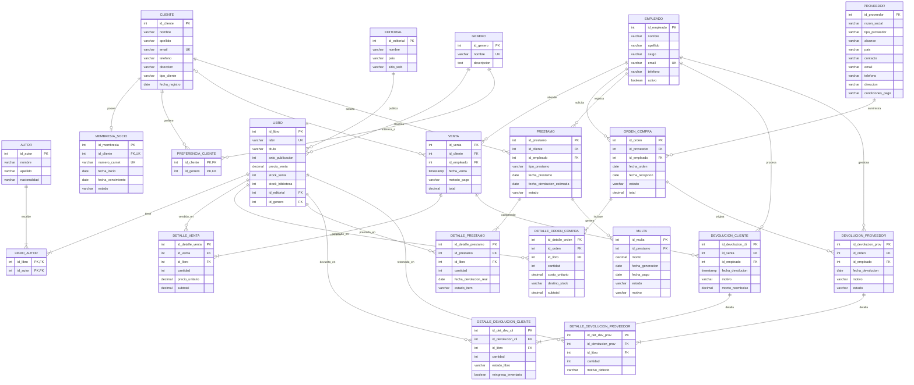

```mermaid
erDiagram
    EDITORIAL {
        int id_editorial PK
        varchar nombre
        varchar pais
        varchar sitio_web
    }

    GENERO {
        int id_genero PK
        varchar nombre UK
        text descripcion
    }

    AUTOR {
        int id_autor PK
        varchar nombre
        varchar apellido
        varchar nacionalidad
    }

    LIBRO {
        int id_libro PK
        varchar isbn UK
        varchar titulo
        int anio_publicacion
        decimal precio_venta
        int stock_venta
        int stock_biblioteca
        int id_editorial FK
        int id_genero FK
    }

    LIBRO_AUTOR {
        int id_libro PK,FK
        int id_autor PK,FK
    }

    PROVEEDOR {
        int id_proveedor PK
        varchar razon_social
        varchar tipo_proveedor
        varchar alcance
        varchar pais
        varchar contacto
        varchar email
        varchar telefono
        varchar direccion
        varchar condiciones_pago
    }

    EMPLEADO {
        int id_empleado PK
        varchar nombre
        varchar apellido
        varchar cargo
        varchar email UK
        varchar telefono
        boolean activo
    }

    CLIENTE {
        int id_cliente PK
        varchar nombre
        varchar apellido
        varchar email UK
        varchar telefono
        varchar direccion
        varchar tipo_cliente
        date fecha_registro
    }

    MEMBRESIA_SOCIO {
        int id_membresia PK
        int id_cliente FK,UK
        varchar numero_carnet UK
        date fecha_inicio
        date fecha_vencimiento
        varchar estado
    }

    PREFERENCIA_CLIENTE {
        int id_cliente PK,FK
        int id_genero PK,FK
    }

    VENTA {
        int id_venta PK
        int id_cliente FK
        int id_empleado FK
        timestamp fecha_venta
        varchar metodo_pago
        decimal total
    }

    DETALLE_VENTA {
        int id_detalle_venta PK
        int id_venta FK
        int id_libro FK
        int cantidad
        decimal precio_unitario
        decimal subtotal
    }

    ORDEN_COMPRA {
        int id_orden PK
        int id_proveedor FK
        int id_empleado FK
        date fecha_orden
        date fecha_recepcion
        varchar estado
        decimal total
    }

    DETALLE_ORDEN_COMPRA {
        int id_detalle_orden PK
        int id_orden FK
        int id_libro FK
        int cantidad
        decimal costo_unitario
        varchar destino_stock
        decimal subtotal
    }

    PRESTAMO {
        int id_prestamo PK
        int id_cliente FK
        int id_empleado FK
        varchar tipo_prestamo
        date fecha_prestamo
        date fecha_devolucion_estimada
        varchar estado
    }

    DETALLE_PRESTAMO {
        int id_detalle_prestamo PK
        int id_prestamo FK
        int id_libro FK
        int cantidad
        date fecha_devolucion_real
        varchar estado_item
    }

    MULTA {
        int id_multa PK
        int id_prestamo FK
        decimal monto
        date fecha_generacion
        date fecha_pago
        varchar estado
        varchar motivo
    }

    DEVOLUCION_CLIENTE {
        int id_devolucion_cli PK
        int id_venta FK
        int id_empleado FK
        timestamp fecha_devolucion
        varchar motivo
        decimal monto_reembolso
    }

    DETALLE_DEVOLUCION_CLIENTE {
        int id_det_dev_cli PK
        int id_devolucion_cli FK
        int id_libro FK
        int cantidad
        varchar estado_libro
        boolean reingresa_inventario
    }

    DEVOLUCION_PROVEEDOR {
        int id_devolucion_prov PK
        int id_orden FK
        int id_empleado FK
        date fecha_devolucion
        varchar motivo
        varchar estado
    }

    DETALLE_DEVOLUCION_PROVEEDOR {
        int id_det_dev_prov PK
        int id_devolucion_prov FK
        int id_libro FK
        int cantidad
        varchar motivo_defecto
    }

    EDITORIAL ||--o{ LIBRO : "publica"
    GENERO ||--o{ LIBRO : "clasifica"
    LIBRO ||--|{ LIBRO_AUTOR : "tiene"
    AUTOR ||--|{ LIBRO_AUTOR : "escribe"

    CLIENTE ||--o| MEMBRESIA_SOCIO : "posee"
    CLIENTE ||--o{ PREFERENCIA_CLIENTE : "prefiere"
    GENERO ||--o{ PREFERENCIA_CLIENTE : "interesa_a"

    CLIENTE |o--o{ VENTA : "realiza"
    EMPLEADO ||--o{ VENTA : "atiende"
    VENTA ||--|{ DETALLE_VENTA : "contiene"
    LIBRO ||--o{ DETALLE_VENTA : "vendido_en"

    PROVEEDOR ||--o{ ORDEN_COMPRA : "suministra"
    EMPLEADO ||--o{ ORDEN_COMPRA : "solicita"
    ORDEN_COMPRA ||--|{ DETALLE_ORDEN_COMPRA : "incluye"
    LIBRO ||--o{ DETALLE_ORDEN_COMPRA : "solicitado_en"

    CLIENTE ||--o{ PRESTAMO : "solicita"
    EMPLEADO ||--o{ PRESTAMO : "registra"
    PRESTAMO ||--|{ DETALLE_PRESTAMO : "comprende"
    LIBRO ||--o{ DETALLE_PRESTAMO : "prestado_en"
    PRESTAMO ||--o{ MULTA : "genera"

    VENTA ||--o{ DEVOLUCION_CLIENTE : "origina"
    EMPLEADO ||--o{ DEVOLUCION_CLIENTE : "procesa"
    DEVOLUCION_CLIENTE ||--|{ DETALLE_DEVOLUCION_CLIENTE : "detalla"
    LIBRO ||--o{ DETALLE_DEVOLUCION_CLIENTE : "devuelto_en"

    ORDEN_COMPRA ||--o{ DEVOLUCION_PROVEEDOR : "origina"
    EMPLEADO ||--o{ DEVOLUCION_PROVEEDOR : "gestiona"
    DEVOLUCION_PROVEEDOR ||--|{ DETALLE_DEVOLUCION_PROVEEDOR : "detalla"
    LIBRO ||--o{ DETALLE_DEVOLUCION_PROVEEDOR : "retornado_en"
```